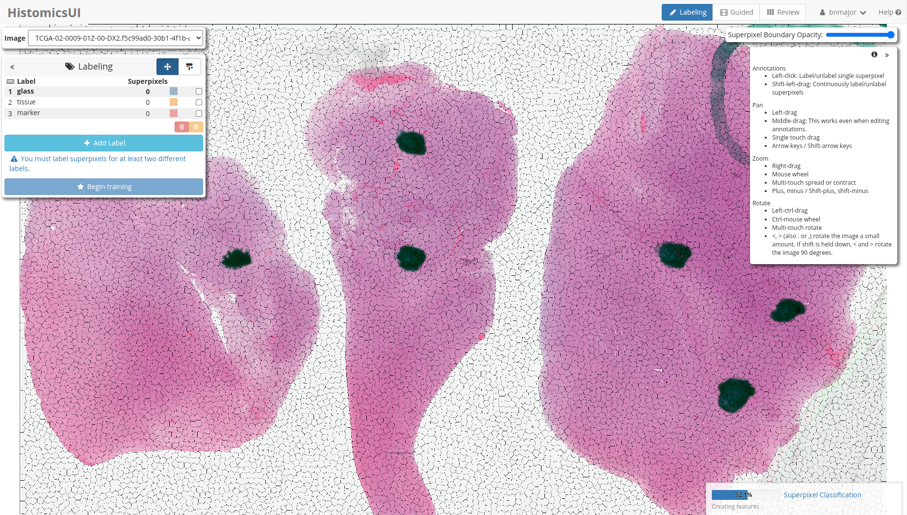

# Summary

`Histomics Label` is a software tool for the interactive development of machine-learning classifiers for whole slide pathology images. It is deployed as part of the Digital Slide Archive [@Gutman2017; @digitalslidearchive], a web-based data management system for whole slide image datasets, and was built on top of HistomicsUI [@histomicsui] and uses the HistomicsTK [@histomicstk] image analysis tool kit.

Users label image regions or tissue structures to provide training data for classifiers and iteratively improve these classifiers by reviewing their output and providing additional labels. The interface uses heuristics to guide users to the most impactful examples to label, and supports bulk labeling of samples and review of labeled examples for collaboration. An example data generation pipeline is included that segments a whole slide image into superpixels, and generates feature embeddings for segmented regions using a foundation model. 

# Statement of need

One of the limitations in developing classification models is the need for labeled data. In pathology and other medical fields, the expertise required for labeling and busy schedules of medical experts make labeling particularly challenging. For whole slide images, where each image can contain several billion pixels, navigating vast datasets in search of possibly rare tissue states can be very inefficient and frustrating. Software interfaces need to be optimized for the user experience and make the most of an expert's time and energy. 

Other issues in labeling include the volume and accessibility of data.  Software that must run local to the data requires that all data be copied and correctly versioned for the project.  Using a web-client and server model with appropriate permission models, only requires that the data be on centrally managed server.  This allows there to be a single, coordinate source of data for a project, and reduces the burden on individual users to only requiring a web browser and ordinary internet connection.  This enables collaboration between multiple experts, or to allow experts to review the work of their trainees.

`Histomics Label` uses a technique called active learning to identify the unlabeled examples that can provide the most benefit to classifier performance and provides an intuitive workflow 
for presenting these examples to experts for efficient labeling. Data can be generated using a built-in pipeline that partitions whole-slide images into superpixels, or users can provide their own data from external cell or tissue segmentation algorithms. Users specify the categories that can be labeled and assign display properties like color, and can exclude categories from classifier training (for instance, for regions whose categories cannot be accurately determined).  After labeling a few initial example regions, a classifier is trained and used to both predict the category of all regions and the unlabeled regions that provide the most classifier benefit.  The user can retrain the classifier at any time and review the classifier predictions and labels from other users. Labeling can also be performed by painting directly on the whole slide image with a brush tool.

For development, the initial segmentation uses superpixels generated with the SLIC [@SLIC2012] algorithm.  These are computed on whole slide images in a tiled manner so that they can work on arbitrarily large images, and the tile boundaries are properly handled to merge seamlessly.  Once generated, segments are represented in one of two ways, either as two-dimensional patches, each centered in a fixed-sized square of masked pixels, or as one-dimensional feature embeddings, such as those generated from the huggingface UNI [@huggingface2024uni] foundation model.  One of two basic models is trained based upon the segment representation.  For two-dimensional patches, the model to be trained is a small-scale CNN implemented in tensorflow/keras or torch.  For one-dimensional vectors, the model to be trained is a single-layer linear classifier.  The certainty criteria for which segments should be labeled next can also be selected, and includes confidence, margin, negative entropy, and the BatchBALD [@batchbald2019] algorithm.

We had a placental pathologist provide feedback to validate the efficiency of the user interface and utility of the process.

# Basic Workflow

When starting a new labeling project, the user selects how superpixels are generated, which certainty metric is used for determining the optimal labeling order, and what features are used for model training.  The labeling mode allows defining project labels and performing initial labeling.  This mode can also be used to add new label categories or combine two categories if they should not have been distinct.  Label categories can additionally be marked as excluded, which removes them from training and ensures that superpixels with those labels are no longer suggested for labeling.

Once some segments have been labeled and an initial training process has been performed, additional segments are shown with their predictions.  The user can use keyboard shortcuts or the mouse to confirm or correct labels.  These are presented in an order that maximizes the utility of improving the model based on the originally selected certainty metric.

To check on overall behavior or correct mistakes, there is a review mode that allows seeing all labeled segments with various filtering and sorting options.  This can be used to check agreement between pathologists or determine how well the model agrees with the manually labeled data.

The whole slide image data in these figures are from data generated by the TCGA Research Network [@TCGA].

# Acknowledgements

This work has been funded in part by National Library of Medicine grant 5R01LM013523 entitled "Guiding humans to create better labeled datasets for machine learning in biomedical research".

# References
